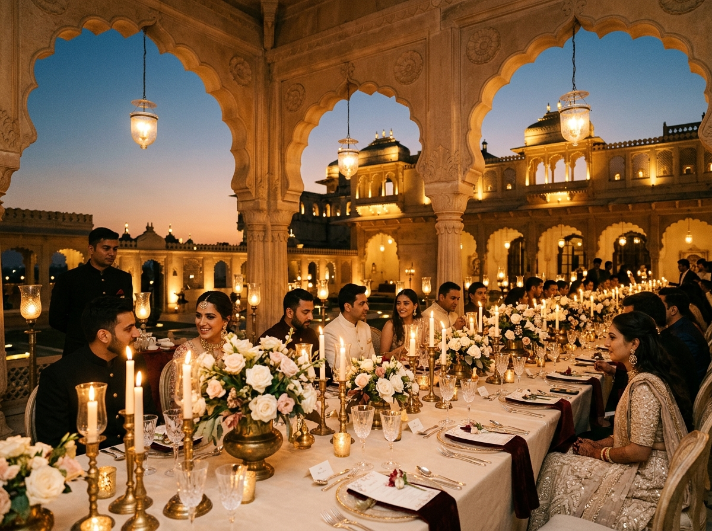

# Ember & Ivory Events

> **Jaipur • Private Events & Destination Weddings • Est. 2018**  
> Bespoke event and wedding architects crafting timeless royal celebrations, high-level corporate summits, intimate milestone soirées, and monumental spatial scenography.



---

## Brand Identity

| Token | Hex | Role |
|---|---|---|
| **Ink** | `#1A1816` | Near-black warm charcoal body & structural frames |
| **Parchment** | `#EFE8DA` | Warm ivory background |
| **Bone** | `#FAF7F0` | Card & plate background |
| **Oxblood** | `#6B2333` | Signature accent (CTAs, key dividers) |
| **Brass** | `#A6813C` | Secondary accent & metallic framing |
| **Stone** | `#8C8577` | Muted neutral for labels & metadata |

### Typography
- **Headlines**: Newsreader (Editorial Serif) via `next/font/google`
- **Body & UI**: Work Sans (Clean Geometric Sans) via `next/font/google`

---

## Core Disciplines & Features

1. **Section 1: Disciplines & Services** (`#services`)
   - 5 Core Verticals: *Heritage Weddings*, *Corporate Galas & Summits*, *Private Soirées*, *Spatial Scenography & Floral Architecture*, and *Artist Curation & Anchor Booking*.
   - Interactive Master Dossier with 3 lenses: *Scope & Deliverables*, *Run-of-Show Protocol*, and *Venue Feasibility & Guidelines*.
   - The Four-Phase Commission Protocol (Atelier Workflow).
   - Curated Heritage Venues Matrix (Jaipur, Udaipur, Jodhpur, and Hinterlands).
2. **Section 2: Portfolio & Gallery** (`#portfolio`)
   - 6 Landmark Commission Case Studies with high-resolution photography plates.
   - Discipline category filters (*Weddings*, *Galas & Summits*, *Private Soirées*, *Scenography*, *Music & Performance*).
   - Interactive Case Study Modal Dossier with architectural notes, patron parameters, deliverables, and palette chemistry.
   - 100% Server-Side Rendered (SSR) content compliant.

---

## Tech Stack

- **Framework**: [Next.js 15](https://nextjs.org/) (App Router)
- **Language**: [TypeScript](https://www.typescriptlang.org/)
- **Styling**: [Tailwind CSS](https://tailwindcss.com/)
- **Animations**: [Framer Motion](https://www.framer.com/motion/)
- **Icons**: [Lucide React](https://lucide.dev/)
- **Image Optimization**: `next/image` with AVIF/WebP support

---

## Local Development

```bash
# Clone the repository
git clone https://github.com/Yashsoni7978/Ember-Ivory-Events.git
cd Ember-Ivory-Events

# Install dependencies
npm install

# Start the local development server
npm run dev
```

Open [http://localhost:3000](http://localhost:3000) to view the application.

---

## Production Build & Deployment

```bash
# Generate production bundle
npm run build

# Start production server
npm run start
```

Deployable to [Vercel](https://vercel.com/) with zero configuration.

---

## License

Built for **Siyara Innovations** (Jaipur, India). All rights reserved.
